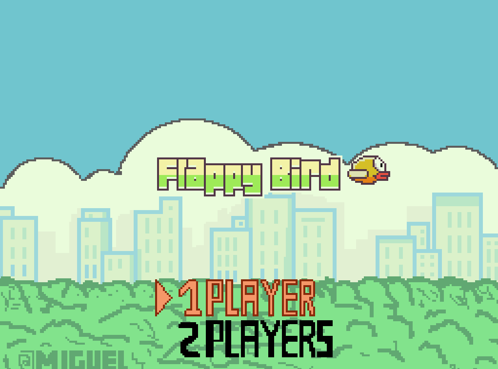
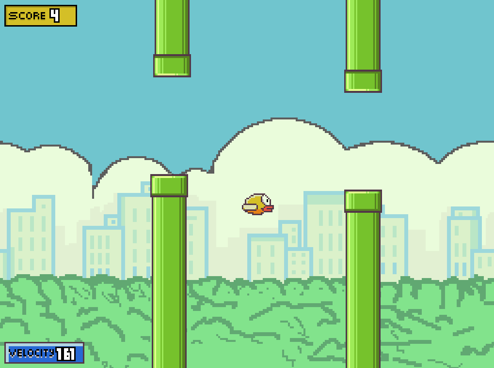

# FlappyBird 🐦

Implementación de Flappy Bird en Java con OpenGL.

# Integrantes 🧑
- Nombre: Miguel Angel Cuellar Serrudo
- Registro: 221044371

## Descripción

Este proyecto fue realizado en base al codigo del docente, los cambios que se hicieron fueron:

* Organizacion de directorios (Arquitecturas y patrones)
* Uso de sprites y su respectivo mapeo en formato `.json`
* Se agrego efectos de sonido
* Animaciones con sprites
* Fondos y sprites hechos en Piskel (ver assets/scenary.piskel)
* Efecto parallax
* Subida de nivel conforme avanza por los Pipes
* Modo 2 jugadores
* Manejo de score y se muestra en el HUD del juego

## Previsualizacion




## Requisitos 

- Java 17+ (JDK)
- Maven

## Arquitectura y patrones

- MVC como arquitectura, separanda la logica de lo visual
- Patrones de diseño:
  - Factory
  - Singleton

## Controles 🎮

Se pueden cambiar los controles en la parte del `MenuCore` que es dondese crean los player con el metodo `startGame()`.

* En el Menu:
    - `Flechas: Up/Down`: Selecciona si jugar con un jugador o con 2
    - `Enter`: Inicia el juego con la configuracion seleccionada

* En el juego:
    - `Espacio`: Salta las tuberias (Solo para el jugador 1)
    - `W`: Salta las tuberias (Solo para el jugador 2)


## Compilar

Desde la raíz del proyecto ejecuta:

```bash
mvn compile
```

Luego puedes ejecutar la clase principal usando el plugin de Maven:

```bash
mvn exec:exec
```

## Ejecutar tests

```bash
mvn test
```

## Estructura

La fuente está en `src/main/java/com/flappybird`

- ### Controllers
    Aqui se encuentra el manager de las teclas, encargado de leer las teclas que el usuario presiona
- ### Core
    Logica pura, aqui se crean lasa entidades para luego renderizarlas, como tambien se modifican los modelos y creacion de entidades (pipes y pajaros en caso sean 2)
    Tiene un Manager: `CoreManager` que maneja cada uno de los Core en base al estado del juego.
- ### Factories
    Patron factory, crea entidades con sus respectivos datos y los devuelve
- ### Graphics
    Aqui vive toda la logica del motor grafico OpenGl y el GameLoop principal, se manejan 2 maneras de renderizar:
    `BasicRender` y `SpriteRenderer`, uno dibuja cuadrados y otro sprites.
- ### Interfaces y Utils
    Clases, enums y records que son reutilizables en todo el proyecto.
- ### Models
    Estructura del juego, aqui vive todo los datos del juego.
- ### Views
    Encargado 100% en dibujar en la pantalla, con los datos de los `Cores`.